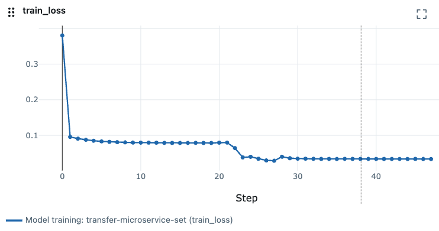
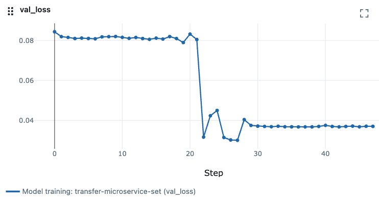
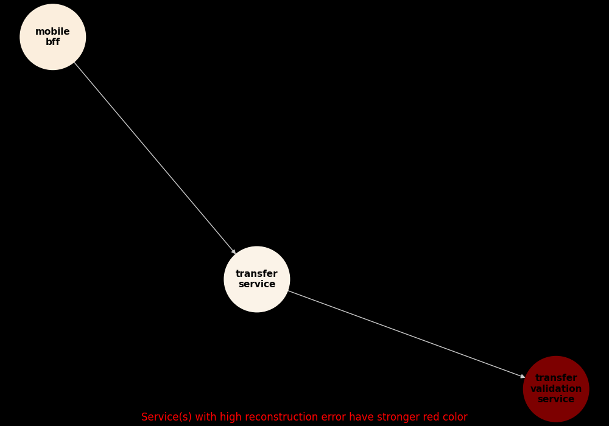

# ML (Machine Learning) Based Anomaly Detector

### Developed by Thomas Selin

This service looks for unusual behaviour in sets of interacting microservices by learning from observability data (for example nr. of errors, memory usage, latency, nr. of calls to api:s) what normal behaviour looks like.

It learns what normal looks like by training a hybrid autoencoder/transformer type machine learning model.

By knowing what normal behaviour looks like it can, using the model, judge whether the current behaviour is unusual and in that case send alerts/alarms to chat-channel/e-mail/etc (implement sending logic for your specific notification channel).

This project builds upon work that was done in the university course Multivariate data analysis at Mälardalens University year 2024. The original project report is provided on request.

## Model training details

The model training implements an autoencoder/transformer hybrid model. The model is trained to reconstruct the input data, which is a multivariate time series of observability metrics (for example nr. of errors/warnings, memory usage, latency, nr. of calls to api:s) for a set of microservices that interact with each other.

The training implements early stopping and restoring of model checkpoints so the model with best validation loss will be used for inference (instead of the model parameters for the last epoch).

## MLflow Visualizations

In MLflow, you can see how the model training and inference progressed, such as the development of training and validation loss over time. By default, the MLflow UI is accessible at [http://localhost:5000](http://localhost:5000). Navigate to the `ML Based Anomaly Detector` experiment to view the details.

<table>
<tr>
<td></td>
<td></td>
</tr>
</table>

## How to setup a local development environment and run the project

### Pre-requisites

* Python installation (tested with version 3.12.12).
* Package manager: [Poetry](https://github.com/python-poetry/poetry) (tested with version 2.0.1).
* For building model and inferencing on you own data, you need access to a Splunk and Prometheus instance with relevant data. Sample data is provided for testing purposes.

### Steps

#### 1. Install dependencies

```sh
poetry install
```

#### 2. Set env vars

Create a copy of the `.env.example` file and rename it to `.env` and fill in your environment variables.

#### 3. OPTIONAL: Start mlflow-server
Optionally start MLflow server for visualizations and model training monitoring. Run below command a in separate shell/terminal window (NOTE: you need to activate the virtual environment first).

```sh
poetry run mlflow server
```

#### 4. Run application (both continuous training/re-training and inferencing)

Either use the VSCode launch configurations, normally the config called `Use already downloaded data`, or run the `main.sh` from the repo root folder as below.

> **Note 1:** To test building and inferencing the model with provided sample data, set the `DOWNLOAD=false` environment variable as shown below or in the `.env` file. Set `DOWNLOAD=true` if you have access to a Splunk and Prometheus instance and want to use your own data.

> **Note 2:** If you encounter SSL-certificate issues while downloading data from Splunk or Prometheus, consider setting the `CURL_CA_BUNDLE`, `SSL_CERT_FILE`, and `REQUESTS_CA_BUNDLE` environment variables to point to your certificate file. These can be configured in the `main.sh` file, the `.env` file, or the VSCode launch configuration (`.vscode/launch.json`).

> **Note 3 (recommended):** By default the service verifies TLS certificates for Splunk/Prometheus requests. If you are using self-signed certs in local/dev you can set `REQUESTS_VERIFY=false` in your `.env` file.

```sh
poetry run ./main.sh
```

## Good to know

1. If you want to adjust how likely an anomaly needs to be to be classified as an anomaly, adjust the `anomaly_threshold_percentile` parameter in `src/ml_monitoring_service/resources/service_sets.yaml` for each microservice set. A higher value means that only more unlikely anomalies will be classified as anomalies. A lower value means that more anomalies will be classified as anomalies.
2. To define other service sets, edit the `src/ml_monitoring_service/resources/service_sets.yaml` file. Each service set can have its own configuration for training/inference lookback times, window size, anomaly threshold percentile etc.
3. The model will work best if it is trained on normal data. If the training data contains a lot of anomalous data, the model will learn that as normal behaviour and will not be able to detect similiar anomalies. So either pause the service or adjust the training data timerange to a time when you know the system was working well. Future plans for this project includes adding logic that automatically pauses training if too many anomalies are present in the training data.
4. Setting ``DOWNLOAD`` env. variable to ``false`` will skip downloading (and combining) Splunk and Prometheus data. This can be benificial if you are developing or testing other parts than the downloading/combining logic and already have downloaded the data once. This way you can save some time. There is a prepared launch config (in ``.vscode/launch.json``) called ``Use already downloaded data (standard)`` that can be used in VSCode. Other launch configs are also available for using sampling or a subset of the data.
5. While developing and as default, the model training is configured to only train for a low number of epochs. To create a better fitted model, increase `MAX_EPOCHS` in `constans.py` to a higher number, for example `100`. This will ensure the models will be trainend until a loss platue is reached.
6. To run tests, start MLflow by running `poetry run mlflow server`, then run the terminal command `poetry run pytest` from the repo root folder.
7. After the service has analysed a timerange for any anomalies, a graph is created in the `output` folder for each microservice set that shows which service had the most unusual/anomalous behaviour. See below examples.

8. **Threshold recalculation on inference:** By default, inference uses the anomaly threshold persisted from training/validation. This is the safest default because it avoids "contaminating" the threshold with anomalous data.
	If you explicitly want to recompute the threshold from the current inference dataset (useful for experiments or strong drift scenarios), set `RECALCULATE_THRESHOLD_ON_INFERENCE=true`. Use with care: if the inference window contains true anomalies, recalculation can raise the threshold and reduce sensitivity.

<table>
<tr>
<td></td>
<td></td>
</tr>
</table>
